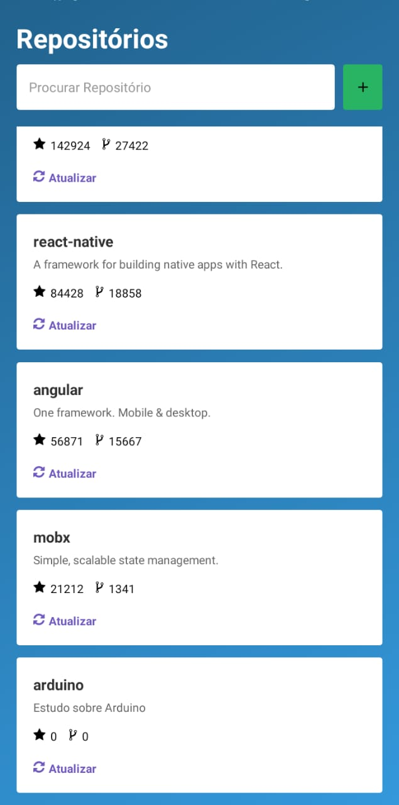

<h1 align="center">Welcome to React Native + RealmDB + API Github 👋</h1>
<p>
  
  <a href="https://twitter.com/marcelxsilva" target="_blank">
    
  </a>
</p>

> Aplicação desenvolvida para aplicar conceitos de RealmDB no React Native

Realm é um banco de dados que possibilita o armazenamento de informacoes offline no dispositivo.

## Install

```sh
yarn
// or
npm install
```

## Usage

```sh
react-native run-android
```

### Ferramentas Auxiliares
 - react-native-linear-gradient
 - react-native-vector-icons
 - styled-components
 - realm
 - react-native-status-bar-height
 
#### Realm

Para identificar a tabela no banco foi criado uma schema de Repository, onde foi definido todas as configuraçoes.

Para realizar a conexão com o banco, foi criado um arquivo em <code>services/realm.js</code> onde recebe todas as schemas criadas e retorna a conexão pronta.

### Resultado



## Author

👤 **Marcelo Silva**

* Twitter: [@marcelxsilva](https://twitter.com/marcelxsilva)

## Show your support

Give a ⭐️ if this project helped you!

***
